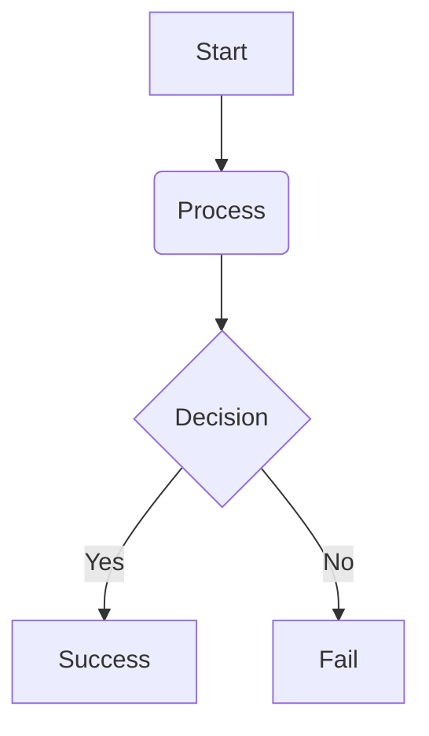

_This project has been created as part of the 42 curriculum by atahiri-, obahya._


# Pac-Man

• A “Description” section that clearly presents the project, including its goal and a
brief overview.
## Description:

This project is a Python remake of the original Pac-man game using minimal features from pygame graphics library.

• An “Instructions” section containing any relevant information about compilation,
installation, and/or execution.
## Instructions:

### Installation:

To install the necessary dependecies, just run the appropriate make rule:

```bash
make install
```

This is equivalent to running:

```bash
uv sync
```

### Excution:

In order to run the game, simply do:

```bash
make run
```

Which is equivalent to:

```bash
uv run python pac_man.py
```

### Deployment:

• A “Resources” section listing classic references related to the topic (documentation, articles, tutorials, etc.),
as well as a description of how AI was used —specifying for which tasks and which parts of the project.
## Resources:

### Documentation:

These are the documentations that were used during the making of this project:

* [MiniLibX official 42 docs](https://harm-smits.github.io/42docs/libs/minilibx)
* [PyGame docs](https://www.pygame.org/docs/)

### Articles:

### Tutorials:

### AI Usage:

• A Configuration section explaining the config file structure and default values.
## Configuration:

| Field | Description | Type | Default |
|-------|-------------|------|---------|
|LEVELS|             |      |         |
|POINTS_PER_PACGUM|
|POINTS_PER_SUPER_PACGUM|
|POINTS_PER_GHOST|
|SUPERGUM_DURATION|

Fields of the levels:
width height
seed of the maze
time limit
speed of player
speed of ghosts
number of pacgums < than width * height


===TODO===: OSSAMA 3MER HAD SECTION!!!

• A Highscore section explaining how the highscore system works and why you
decided to implement it this way.
## Highscore:

WE ADDED A PASSWORD ALONGSIDE THE USERNAME, BECAUSE IDK LIFE IS TOO EASY I GUESS (PLS KILL ME)
===TODO===: OSSAMA 3MER HAD SECTION!!!

• A Maze Generation section explaining how the assigned A-Maze-ing package is
used to generate mazes.
## Maze Generation:

• an Implementation section with a technical summary of your implementation.
## Implementation:
- the visual engine
- the logical engine:
===TODO===: OSSAMA 3MER HAD SECTION!!!

• A General Software Architecture section, with high-level overview of the software architecture (modules, classes, and their relationships).
## General Software Architecture:

• A Project Management section, with a brief overview of how you managed the
project and a link to the dedicated project management directory.
## Project Management:

