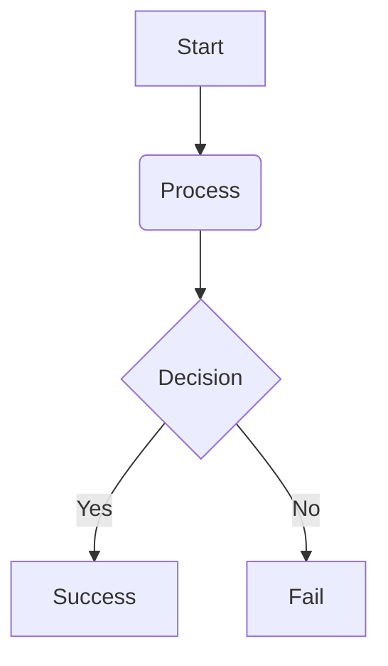

_This project has been created as part of the 42 curriculum by atahiri-, obahya._


# Pac-Man

## Description:

This project is a Python remake of the original Pac-man game using minimal features from pygame graphics library.
The goal of the project is to create a playable version of the classic Pac-man game, complete with a maze, ghosts, and power-ups. The game is designed to be simple yet engaging, providing players with a nostalgic experience while also showcasing the capabilities of Python and pygame.

## Instructions:

### Installation:

To install the necessary dependecies, just run the appropriate make rule:

```bash
make install
```

This is equivalent to running:

```bash
uv sync
```

### Excution:

In order to run the game, simply do:

```bash
make run
```

Which is equivalent to:

```bash
uv run python pac_man.py
```

• A “Resources” section listing classic references related to the topic (documentation, articles, tutorials, etc.),
as well as a description of how AI was used —specifying for which tasks and which parts of the project.
## Resources:

### Documentation:

Since the project does not require much theory and since we were already familiar with the libraries used, we did not use any documentation for the implementation of the project. However, we did use some documentation to understand how to use the libraries and their features.

* [MiniLibX official 42 docs](https://harm-smits.github.io/42docs/libs/minilibx)
* [PyGame docs](https://www.pygame.org/docs/)

### AI Usage:

The AI was not used to write actual code, but rather it was used for boilerplate docs and as brainstrorming tool to design high level architecture and to generate ideas for the project. It was used to help with the following tasks:

* Improving the documentation of the project.
* Making the readme more readable and structured.
* rethinking the architecture of the project and generating ideas for the implementation.

## Configuration:


Config is JSON (`config.json`, passed as a CLI arg) parsed and validated by
Pydantic models in `parser.py` (`Config`, `LevelConfig`). Unknown **root** keys
are ignored; level entries are validated strictly. On any error it falls back to
safe defaults.

```json
{
  "levels": [
    { "width": 14, "height": 14, "seed": 42, "level_max_time": 12 },
    { "width": 15, "height": 20, "seed": 42 }
  ],
  "lives": 3,
  "points_per_pacgum": 10,
  "points_per_super_pacgum": 50,
  "points_per_ghost": 200,
  "super_pacgum_duration": 500
}
```

**Top-level (`Config`) defaults**

| Field | Default | Notes |
|---|---|---|
| `levels` | 10 default level | played in order |
| `lives` | `3` | `1–5` |
| `points_per_pacgum` | `10` | |
| `points_per_super_pacgum` | `50` | |
| `points_per_ghost` | `200` | |
| `super_pacgum_duration` | `500` | FRIGHTENED ticks |

**Per-level (`LevelConfig`) defaults**

| Field | Default | Notes |
|---|---|---|
| `width` / `height` | `28` / `31` | `≥ 10` |
| `seed` | `1337` | RNG seed → reproducible maze |
| `level_max_time` | `90` | seconds (`ticks = time × 60`) |
| `speed` | `100` | `1–100`; ghosts use `speed × 0.4` |
| `pacgum` | `1337` | declared, not consumed |

> **Caveat:** the shipped `config.json` uses `level_max_timer` (typo) instead of
> `level_max_time`. Since `LevelConfig` rejects extra keys, this silently drops
> the whole `levels` array and falls back to one default level.

---

## Highscore

Implemented in `src/db_manager/user.py` via two classes:

- **`User`** (Pydantic): `username` (1–10 alnum), `password` (**SHA-256 hashed**, never plaintext), `highscore` (`≥ 0`).
- **`UserManager`**: stores one JSON file per user in `./database/`.
  - `load_all_users()` / `save_user_data()` — load & persist users.
  - `create_new_user()` / `authenticate_user()` — register or log in (sets active `loged_in_user`).
  - `update_highscore(score)` — **only if logged in and only when the new score is higher** (monotonic best-run rule); persists on change.
  - `get_leaderboard()` — users sorted by `highscore` desc.
  - `logout_user()`.

**Flow:** on game over, `GameOverScene` shows login forms — existing users are
authenticated, new ones are created, then `update_highscore(final_score)` runs.
If already logged in it offers an **Update** button. `LeaderBoardScene` shows
the top 10 via `get_leaderboard()[:10]`.

**Why this way:** file-per-user JSON keeps it dependency-light (no DB/server,
easy to inspect/back up); passwords are hashed; the "max only" rule preserves a
true best score; the model is validated (safe filenames, non-negative scores);
and the UI only calls high-level `UserManager` methods, so the storage backend
can be swapped without touching scenes.

---

## Maze Generation

Mazes come from the assigned **A-Maze-ing** package, vendored here as
`mazegenerator` (`MazeGenerator` in `mazegenerator/mazegenerator.py`), imported
by `src/logical/maze.py` via `from mazegenerator import MazeGenerator`.

- **Wall encoding:** each cell is an int whose bits are walls — `1=N, 2=E, 4=S,
  8=W`. `15` = fully solid (impassable), `0` = open.
- **`generate(seed)`** seeds RNG, builds a bordered maze with a decorative "42"
  obstacle, carves passages with a **recursive-backtracker (DFS)** (randomly
  adding loops when not `perfect`), then BFS-computes the shortest path.
- **Used by `LogicalMaze.load_level()`:**
  ```python
  self.maze_generator = MazeGenerator((self.width, self.height), seed=int(level.seed))
  self.grid = self.maze_generator.maze
  ```
  The grid is the single source of truth: `can_move()` checks wall bits per
  direction, and pellets/ghosts skip cells equal to `15`. Each level's `seed`
  makes its layout deterministic and reproducible.

---

## Implementation

- **Stack:** Python ≥3.13, Pygame (640×480, scaled), Pydantic, NumPy. Built with
  `uv` + `Makefile` (`make run`/`debug`/`lint`/`deploy` → PyInstaller "Spooks").
- **Boot/loop (`pac-man.py`):** init Pygame → `UserManager` + `AssetManager` +
  `parse_config` → `Context` → `LoadingScene` → main loop (input → `update(delta)`
  → clear → `render` → flip). Quit on `QUIT`/`Esc`/`Q`.
- **Scene graph:** `GameComponent` (tree + update/input) → `Node` (+ position/
  render). Maze drawn tile-by-tile via a 2×2 neighborhood corner lookup.
- **Logic/view split:** `src/logical` is pure Python (no Pygame). `LogicalMaze`
  advances state via `tick_player`/`tick_ghost`/`tick_timers` and **emits
  immutable `GameEvent`s** (e.g. `AtePacgum`, `PlayerDied`, `LevelComplete`)
  collected and returned by `flush_events()`. `VisualMaze` calls `tick_timers()`
  at a fixed **60 Hz** and translates events into animation (death, freeze,
  particles, shake, level refresh). Player/ghosts interpolate between cells using
  level `speed`.
- **Frame-rate independence:** render uses `delta`; logic ticks fixed at 60 Hz;
  respawn/invuln/ghost-respawn/power-up timers count in ticks.
- **Ghost AI:** greedy chase (minimize distance, no reversing) in `CHASE`,
  flee in `FRIGHTENED`. Deterministic given the grid.

---

## General Software Architecture

Clear one-directional layers:

```
pac-man.py → parser.py ─┐
                        ▼
                     Context (shared state)
        ┌───────────────┼────────────────┐
        ▼               ▼                ▼
   Visual layer    Data layer       Logical layer      ──uses──▶ MazeGenerator
   src/visual/*    db_manager        src/logical/*                 (A-Maze-ing)
   (scenes, ui,    (UserManager,     (LogicalMaze,
    draw, assets)   User)             entities, events)
```

- **`Context`** — singleton-ish shared state (surface, size, assets,
  `user_manager`, `config`, palette, `root_scene`, `game_running`); passed to
  every `Node`.
- **Scenes** (all `Node`s): `RootScene` (background + themes) → `LoadingScene` →
  `TitleScene` → `GameScene` (+ `Pause`, `Instructions`, `LeaderBoard`,
  `GameOver`). `GameScene` is the bridge: it owns a `LogicalMaze` and a
  `VisualMaze` plus HUD widgets.
- **Logical layer:** `LogicalMaze`, `entities` (`Player`/`Ghost`), `core_types`
  (enums), `game_event` (frozen dataclasses). **Never imports Pygame.**
- **Maze package:** `mazegenerator.MazeGenerator` → `LogicalMaze.grid`.
- **Data layer:** `UserManager`/`User`, reached from scenes via
  `Context.user_manager`.
- **Key rule:** `visual → logical → mazegenerator`; Pygame is confined to
  `pac-man.py` and `src/visual`. The logical layer is fully decoupled from
  rendering, so simulation/scoring/AI can be reasoned about independently.

**File structure**

```
src/
├── db_manager/
│   └── user.py
├── logical/
│   ├── core_types.py
│   ├── entities.py
│   ├── game_event.py
│   └── maze.py
└── visual/
    ├── scenes/
    │   ├── game/
    │   │   ├── __init__.py
    │   │   ├── ghost.py
    │   │   ├── maze.py
    │   │   └── player.py
    │   ├── game_over.py
    │   ├── instructions.py
    │   ├── leaderboard.py
    │   ├── loading.py
    │   ├── pause.py
    │   ├── root.py
    │   └── title.py
    ├── ui/
    │   ├── button.py
    │   ├── label.py
    │   ├── panel.py
    │   ├── progress.py
    │   ├── prompt.py
    │   └── text_box.py
    ├── utils/
    │   ├── asset_manager.py
    │   ├── image.py
    │   ├── parallax.py
    │   ├── particle.py
    │   ├── shake.py
    │   ├── sprite.py
    │   └── timer.py
    ├── __init__.py
    ├── draw.py
    └── palette.py
```
