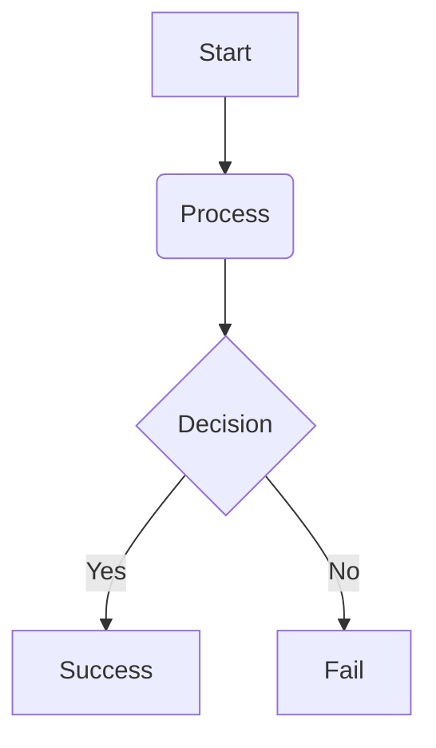

_This project has been created as part of the 42 curriculum by atahiri-, obahya._


# Pac-Man

## Description:

This project is a Python remake of the original Pac-man game using minimal features from pygame graphics library.
The goal of the project is to create a playable version of the classic Pac-man game, complete with a maze, ghosts, and power-ups. The game is designed to be simple yet engaging, providing players with a nostalgic experience while also showcasing the capabilities of Python and pygame.

## Instructions:

### Installation:

To install the necessary dependecies, just run the appropriate make rule:

```bash
make install
```

This is equivalent to running:

```bash
uv sync
```

### Excution:

In order to run the game, simply do:

```bash
make run
```

Which is equivalent to:

```bash
uv run python pac_man.py
```

• A “Resources” section listing classic references related to the topic (documentation, articles, tutorials, etc.),
as well as a description of how AI was used —specifying for which tasks and which parts of the project.
## Resources:

### Documentation:

Since the project does not require much theory and since we were already familiar with the libraries used, we did not use any documentation for the implementation of the project. However, we did use some documentation to understand how to use the libraries and their features.

* [MiniLibX official 42 docs](https://harm-smits.github.io/42docs/libs/minilibx)
* [PyGame docs](https://www.pygame.org/docs/)

### AI Usage:

The AI was not used to write actual code, but rather it was used for boilerplate docs and as brainstrorming tool to design high level architecture and to generate ideas for the project. It was used to help with the following tasks:

* Improving the documentation of the project.
* Making the readme more readable and structured.
* rethinking the architecture of the project and generating ideas for the implementation.

• A Configuration section explaining the config file structure and default values.
## Configuration:

| Field | Description | Type | Default |
|-------|-------------|------|---------|
|LEVELS|             |      |         |
|POINTS_PER_PACGUM|
|POINTS_PER_SUPER_PACGUM|
|POINTS_PER_GHOST|
|SUPERGUM_DURATION|

Fields of the levels:
width height
seed of the maze
time limit
speed of player
speed of ghosts
number of pacgums < than width * height

===TODO===: OSSAMA 3MER HAD SECTION!!!

• A Highscore section explaining how the highscore system works and why you
decided to implement it this way.
## Highscore:

WE ADDED A PASSWORD ALONGSIDE THE USERNAME, BECAUSE IDK LIFE IS TOO EASY I GUESS (PLS KILL ME)
===TODO===: OSSAMA 3MER HAD SECTION!!!

• A Maze Generation section explaining how the assigned A-Maze-ing package is
used to generate mazes.
## Maze Generation:


- the visual engine
- the logical engine:
===TODO===: OSSAMA 3MER HAD SECTION!!!

• A General Software Architecture section, with high-level overview of the software architecture (modules, classes, and their relationships).
## General Software Architecture:

### Code Structure:

TODO: update this diagram to reflect the actual code structure of your project.
```
src
│
├── db_manager
│   └── user.py
│
├── logical
│   ├── core_types.py
│   ├── entities.py
│   ├── game_event.py
│   └── maze.py
│
└── visual
    ├── __init__.py
    ├── draw.py
    ├── palette.py
    │
    ├── scenes
    │   ├── game
    │   │   ├── __init__.py
    │   │   ├── ghost.py
    │   │   ├── maze.py
    │   │   └── player.py
    │   ├── game_over.py
    │   ├── leaderboard.py
    │   ├── loading.py
    │   ├── pause.py
    │   ├── root.py
    │   └── title.py
    │
    ├── ui
    │   ├── button.py
    │   ├── label.py
    │   ├── panel.py
    │   ├── progress.py
    │   ├── prompt.py
    │   └── text_box.py
    │
    └── utils
        ├── asset_manager.py
        ├── image.py
        ├── parallax.py
        ├── particle.py
        └── sprite.py
```

• an Implementation section with a technical summary of your implementation.
## Implementation:

• A Project Management section, with a brief overview of how you managed the
project and a link to the dedicated project management directory.
## Project Management:

